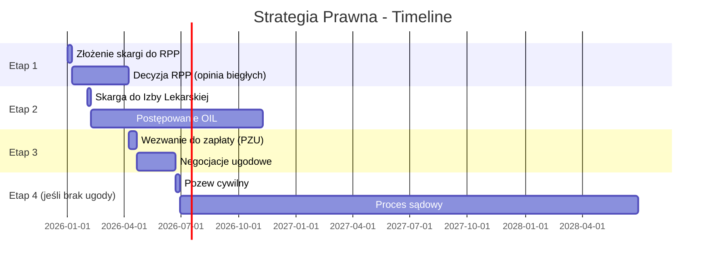

# 📋 STRATEGICZNY RAPORT PRAWNY
## Sprawa: Michał Wiencek vs. Szpital Wojewódzki w Bielsku-Białej

**Data:** 15.01.2026  
**Cel:** Analiza wszystkich dostępnych ścieżek prawnych i rekomendacja optymalnej strategii

---

## I. PODSUMOWANIE WYKONAWCZE

### 🎯 Rekomendowana Strategia (3 ścieżki równoległe):

| Ścieżka | Priorytet | Szacunek kwoty | Czas | Ryzyko |
|:---|:---:|---:|:---:|:---:|
| **1. Skarga do RPP** (art. 50 UPP) | 🔴 KRYTYCZNY | — (opinia biegłego gratis) | 3 mies. | Niskie |
| **2. Pozew cywilny** (art. 415/445 KC) | 🔴 WYSOKI | 450-700 tys. zł + renta | 2-4 lata | Średnie |
| **3. Izba Lekarska** (OIL) | 🟡 ŚREDNI | — (sankcje zawodowe) | 6-12 mies. | Niskie |
| ~~4. Fundusz Kompensacyjny~~ | ❌ WYKLUCZONE | max 222 800 zł | 3 mies. | — |
| ~~5. Postępowanie karne~~ | 🟠 OPCJONALNE | — (wymiar moralny) | 2-5 lat | Wysokie |

---

## II. ANALIZA ŚCIEŻEK PRAWNYCH

### A. SKARGA DO RZECZNIKA PRAW PACJENTA (PRIORYTET #1)

> **STATUS:** Wniosek przygotowany (`WNIOSEK_DO_RPP_V3_CHRONOLOGICZNY.md`)

**Dlaczego to priorytet:**
1. **Darmowa opinia biegłych** – RPP powołuje zespół ekspertów medycznych na swój koszt
2. **Dowód w sprawie cywilnej** – opinia RPP może być dowodem w pozwie
3. **Szybkość** – decyzja w 3 miesiące
4. **Brak zrzeczenia się roszczeń** – w przeciwieństwie do Funduszu Kompensacyjnego

**Co zyskujesz:**
- Oficjalne stwierdzenie naruszenia praw pacjenta
- Opinię biegłych za 0 zł (w sądzie koszt: 2-5 tys. zł per biegły)
- Publicznie dostępną decyzję (presja na szpital)

**Procedura:**
1. Złóż skargę (brak opłaty!)
2. RPP zbiera dokumentację z własnej inicjatywy
3. Zespół ekspertów analizuje sprawę (3 miesiące)
4. Decyzja → dowód do sprawy cywilnej

> [!IMPORTANT]
> **NIE SKŁADAJ WNIOSKU DO FUNDUSZU KOMPENSACYJNEGO!**
> Przyjęcie świadczenia (max 222 800 zł) oznacza **zrzeczenie się dalszych roszczeń**. Przy Twojej sprawie (sepsa, 113 dni hospitalizacji, F43.2) wartość roszczenia to 450-700 tys. zł + renta.

---

### B. POZEW CYWILNY (PRIORYTET #2)

**Podstawy prawne:**
- **Art. 415 KC** – odpowiedzialność deliktowa (wina)
- **Art. 444 KC** – odszkodowanie za uszkodzenie ciała (koszty leczenia, utracony zarobek)
- **Art. 445 KC** – zadośćuczynienie za krzywdę (ból, cierpienie, trauma)
- **Art. 444 § 2 KC** – renta (utrata zdolności do pracy, zwiększone potrzeby)

**Orzecznictwo 2024 – kwoty za sepsę/zakażenia szpitalne:**

| Sprawa | Okoliczności | Kwota zadośćuczynienia |
|:---|:---|---:|
| Sąd 10.2024 | Sepsa + wstrząs po operacji kręgosłupa | **700 000 zł** + odszkodowanie + renta |
| Sąd Apelacyjny | Sepsa → śpiączka → niewydolność wielonarządowa | **250 000 zł** |
| Orzecznictwo | Zakażenie szpitalne z trwałymi następstwami | do **600 000 zł** |

**Twoja sprawa – czynniki podwyższające kwotę:**
1. ✅ Młody wiek (21 lat) – długi horyzont cierpienia
2. ✅ Wstrząs septyczny (bezpośrednie zagrożenie życia)
3. ✅ Diagnoza psychiatryczna F43.2 (dokumentacja z niezależnego ośrodka)
4. ✅ 113 dni hospitalizacji (łącznie wszystkie szpitale)
5. ✅ 2 lata PTSD (unikanie lekarzy)
6. ✅ Drenaż "na żywca" (element tortur – Art. 3 EKPC)
7. ✅ Głodzenie (58 400 kcal deficytu)
8. ✅ Fałszowanie dokumentacji (TPN, dren)

**Szacunek roszczenia:**
| Składnik | Kwota |
|:---|---:|
| Zadośćuczynienie za krzywdę | 400 000 – 550 000 zł |
| Odszkodowanie (koszty leczenia, dojazdy) | 20 000 – 50 000 zł |
| Renta (zwiększone potrzeby, utrata zarobków) | 1 500 – 3 000 zł/mies. |
| **SUMA (5 lat renty)** | **500 000 – 780 000 zł** |

**Strategia procesowa:**
1. Najpierw **skarga do RPP** (darmowa opinia biegłych)
2. Po decyzji RPP → **wezwanie do zapłaty** do ubezpieczyciela szpitala (PZU?)
3. Negocjacje ugodowe (cel: 60-70% roszczenia bez procesu)
4. Jeśli odmowa → **pozew do sądu okręgowego**

---

### C. SKARGA DO IZBY LEKARSKIEJ (PRIORYTET #3)

**Cel:** Odpowiedzialność zawodowa lekarzy (niezależna od cywilnej/karnej)

**Kary możliwe:**
- Upomnienie
- Nagana
- Kara pieniężna
- **Zawieszenie prawa wykonywania zawodu** (1-5 lat)
- Pozbawienie prawa wykonywania zawodu

**Procedura:**
1. Skarga do Okręgowego Rzecznika Odpowiedzialności Zawodowej (OROZ)
2. Postępowanie wyjaśniające (OROZ gromadzi dowody)
3. Ew. postawienie zarzutów
4. Rozprawa przed Okręgowym Sądem Lekarskim
5. Odwołanie do Naczelnego Sądu Lekarskiego

**Wskazani do skargi:**
- Lekarz wykonujący drenaż 20.04.2023 bez znieczulenia
- Lekarz ordynujący Encorton przy CRP 136
- Ordynator (odpowiedzialność organizacyjna)

**Korzyść strategiczna:**
- Wyrok sądu lekarskiego = **dowód w sprawie cywilnej**
- Presja na szpital (ryzyko utraty lekarzy)

---

### D. FUNDUSZ KOMPENSACYJNY – DLACZEGO NIE

> [!CAUTION]
> **ABSOLUTNIE NIE SKŁADAJ WNIOSKU DO FUNDUSZU!**

| Kryterium | Fundusz | Droga sądowa |
|:---|:---:|:---:|
| Max kwota | 222 800 zł | **Bez limitu** |
| Zrzeczenie roszczeń | ✅ TAK | ❌ Nie |
| Czas | 3 mies. | 2-4 lata |
| Twoja szacowana kwota | ~150 000 zł | **450-700 000 zł** |

**Matematyka:**
- Różnica: **300-550 tys. zł** 
- Koszt prawnika (success fee 15-25%): ~100-150 tys. zł
- **Zysk netto przy drodze sądowej:** ~200-400 tys. zł WIĘCEJ

---

### E. POSTĘPOWANIE KARNE – OPCJONALNE

**Podstawa prawna:**
- **Art. 160 § 2 KK** – narażenie na utratę życia przez osobę zobowiązaną (do 5 lat)
- **Art. 156 KK** – ciężki uszczerbek na zdrowiu
- **Art. 271 KK** – fałszowanie dokumentacji

**Uwaga – zmiany w 2024:**
> Zlikwidowano Samodzielne Działy ds. Błędów Medycznych w Prokuraturach Regionalnych. Sprawy nadal będą prowadzone, ale w zwykłych wydziałach.

**Plusy:**
- Wymiar "sprawiedliwości moralnej"
- Prokuratura gromadzi dowody za darmo
- Skazanie = dowód w sprawie cywilnej

**Minusy:**
- Bardzo trudno o skazanie (wymóg "bezpośredniego" niebezpieczeństwa)
- Proces trwa 2-5 lat
- Lekarze często unikają kary ("nieumyślność")

**Rekomendacja:** Rozważ złożenie zawiadomienia PÓŹNIEJ (po uzyskaniu opinii RPP), jako element presji.

---

## III. HARMONOGRAM DZIAŁAŃ

---

## IV. CHECKLIST PRZED ZŁOŻENIEM SKARGI DO RPP

- [ ] **Weryfikacja 15 zarzutów** w `WNIOSEK_DO_RPP_V3_CHRONOLOGICZNY.md`
- [ ] Uzupełnienie danych osobowych (adres, tel, email)
- [ ] Przygotowanie załączników:
  - [ ] Dokumentacja medyczna Bielsko (3 hospitalizacje)
  - [ ] Dokumentacja medyczna Kraków (leczenie naprawcze)
  - [ ] Karta ZRM z 28.04.2023 (gorączka 39.6°C)
  - [ ] Wynik histopatologiczny 23/49105
  - [ ] Eksport Messenger (kluczowe cytaty)
- [ ] Podpisanie wniosku
- [ ] Wysłanie listem poleconym lub przez ePUAP

---

## V. PYTANIA KRYTYCZNE DO ROZSTRZYGNIĘCIA

1. **Czy masz ubezpieczenie prawne?** (niektóre polisy pokrywają koszty prawnika)

2. **Jaki jest Twój budżet na biegłych?** (w sądzie: 2-5 tys. zł per biegły; RPP = za darmo)

3. **Czy zależy Ci na ukaraniu lekarzy?** (Izba Lekarska) czy tylko na pieniądzach? (droga cywilna)

4. **Czy jesteś gotowy na 2-4 lata procesu?** (Fundusz = 3 miesiące, ale 1/3 kwoty)

5. **Czy rozważasz nagłośnienie sprawy medialnie?** (może przyspieszyć ugodę, ale ryzyko)

---

## VI. REKOMENDACJA KOŃCOWA

### OPTYMALNY PLAN DZIAŁANIA:

1. **TERAZ:** Złóż skargę do RPP (WNIOSEK_V3) → darmowa opinia biegłych
2. **Za 2 tyg:** Złóż skargę do Izby Lekarskiej → presja na lekarzy
3. **Po decyzji RPP (~3-4 mies.):** Wezwanie do zapłaty do ubezpieczyciela szpitala
4. **Negocjacje:** Cel = 400-500 tys. zł bez procesu
5. **Plan B:** Pozew do sądu z pełną dokumentacją + opinia RPP jako dowód

### Co NIE robić:
- ❌ NIE składaj wniosku do Funduszu Kompensacyjnego
- ❌ NIE idź od razu do prokuratury (za wcześnie, za trudno)
- ❌ NIE publikuj jeszcze w mediach (zostaw jako kartę przetargową)

---

**Przygotował:** System Antigravity  
**Na podstawie:** Research web 15.01.2026, dokumentacja projektu POZEW
