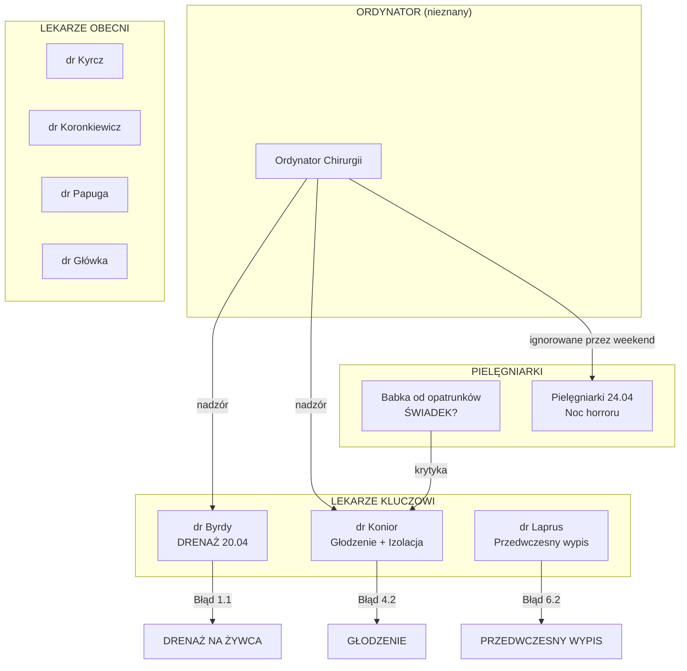

# 👥 MAPA PERSONELU – POWIĄZANIA Z INCYDENTAMI

**Data analizy:** 09.01.2026  
**Źródła:** Dokumentacja medyczna (PDF), Messenger, WhatsApp, raporty dzienne  
**Zakres:** 17.04.2023 – 30.05.2023 (III hospitalizacja)

---

## 📊 PODSUMOWANIE

| Kategoria | Liczba osób | Kluczowe osoby |
|-----------|-------------|----------------|
| **Lekarze (identyfikowani)** | 11 | dr Byrdy, dr Koronkiewicz, dr Konior |
| **Ordynator** | 1 | Nazwisko nieznane (do ustalenia) |
| **Pielęgniarki** | Niezidentyfikowane | "babka od opatrunków" |
| **Anestezjolog** | 1 | dr Tomasz Banyś (30.04) |

---

## 🔴 KATEGORIA A: BEZPOŚREDNI SPRAWCY

### dr Wacław Grzegorz Byrdy (NPWZ: 4963378)
**Rola:** Lekarz wykonujący drenaż 20.04.2023

| Data | Zdarzenie | Błąd | Źródło |
|------|-----------|------|--------|
| **20.04.2023** | **DRENAŻ ROPNIA BEZ ZNIECZULENIA** | Błąd 1.1 🔴 | Wpis dr Byrdy 10:55 |
| 20.04.2023 | Wprowadzenie drenu "na siłę" przez mięśnie | Błąd 1.1 | Histopatologia SU |

> **OCENA:** Odpowiedzialny za najpoważniejszy incydent – zabieg "na żywca". Kluczowy pozwany.

---

### dr Arkadiusz Konior
**Rola:** Lekarz prowadzący (wielokrotne wpisy)

| Data | Zdarzenie | Błąd | Źródło |
|------|-----------|------|--------|
| 24.04.2023, 07:36 | Zlecenie "Dieta płynna" | Błąd 4.2 | Dokumentacja |
| 26.04.2023, 10:58 | Kontynuacja diety płynnej | Błąd 4.2 | Dokumentacja |
| **11.05.2023, 10:45** | **Wpis: "Przeniesiemy pacjenta..."** | Błąd 3.1 | RAPORT_KWIATKI |

> **OCENA:** Odpowiedzialny za utrzymywanie głodówki i opóźnienie izolacji. Wielokrotne wpisy.

---

### dr Arkadiusz Koronkiewicz
**Rola:** Lekarz prowadzący (wielokrotne wpisy)

| Data | Zdarzenie | Błąd | Źródło |
|------|-----------|------|--------|
| 19.04.2023, 10:33 | "Przygotowany do leczenia operacyjnego" | - | Dokumentacja |
| **28.05.2023, 16:00** | **Wpis o "dobrym stanie"** | Błąd 6.2? | RAPORT_KWIATKI |

> **OCENA:** Do zbadania – wpisy o "dobrym stanie" mogą być fałszywe.

---

### ORDYNATOR (nazwisko do ustalenia)
**Rola:** Kierownik Oddziału Chirurgii

| Data | Zdarzenie | Błąd | Źródło |
|------|-----------|------|--------|
| **25.05.2023** | **"Nie znamy się na tej chorobie"** | Błąd 6.4 🔴 | SMS (NOWE SCREENY 12.png) |
| 25.05.2023 | Rozmowa z rodzicami o przeniesieniu | Błąd 6.4 | WhatsApp, Messenger |
| 22.05.2023 | Zlecenia ignorowane przez personel weekendowy | Błąd 6.5 | Messenger |
| 29.05.2023 | Tata czeka na korytarzu na ordynatora | - | WhatsApp |

> **ALARM:** Ordynator PRZYZNAŁ brak kompetencji, ale przez miesiąc nie odesłał do specjalisty!

---

### dr Milena Papuga (NPWZ: 4218463)
**Rola:** Lekarz dyżurny

| Data | Zdarzenie | Błąd | Źródło |
|------|-----------|------|--------|
| **18.05.2023** | **Zlecenie posiewu – NIEZREALIZOWANE** | Błąd 2.3 | RAPORT_DRUGI_POSIEW |

> **OCENA:** Zlecenie zostało zignorowane przez personel weekendowy.

---

## 🟡 KATEGORIA B: LEKARZE OBECNI W DOKUMENTACJI

### dr Anna Kyrcz
| Data | Zdarzenie | Kontekst |
|------|-----------|----------|
| 13.05.2023, 13:21 | Wpis o stanie pacjenta | Dokumentacja wewnętrzna |

---

### dr Bartłomiej Marcin Główka
| Data | Zdarzenie | Kontekst |
|------|-----------|----------|
| 28.04.2023 | Przyjęcie na SOR po powrocie karetką | Dokumentacja SOR |

---

### dr Sułowski
| Data | Zdarzenie | Kontekst |
|------|-----------|----------|
| 21.04.2023, 10:32 | "Dieta płynna" po drenażu | Zlecenie żywieniowe |
| 25.04.2023, 10:19 | Kontrolna TK | Dokumentacja |

---

### dr Góral
| Data | Zdarzenie | Kontekst |
|------|-----------|----------|
| 22.04.2023, 14:43 | "Dieta płynna" | Zlecenie żywieniowe |

---

### dr Laprus
| Data | Zdarzenie | Kontekst |
|------|-----------|----------|
| **27.04.2023, 09:38** | **WYPIS** "stan dobry" | Błąd 6.2 – przedwczesny wypis! |

> **ALARM:** Wypisał pacjenta, który następnego dnia wrócił karetką z gorączką 39.7°C!

---

### dr Michalik
| Data | Zdarzenie | Kontekst |
|------|-----------|----------|
| 18.04.2023 | Przyjęcie na oddział (brak wpisu) | Dokumentacja |
| 24.04.2023, 23:43 | "Dieta płynna" + "Urlano dren" | Weekendowy dyżur |

---

### dr Tomasz Banyś (Anestezjolog)
| Data | Zdarzenie | Kontekst |
|------|-----------|----------|
| **30.04.2023** | Znieczulenie do II drenażu | Karta anestezjologa |

> **WAŻNE:** Ten lekarz DAŁ znieczulenie 30.04 – dowód że było możliwe. Dlaczego 20.04 NIE?

---

## 🟢 KATEGORIA C: PIELĘGNIARKI (NIEZIDENTYFIKOWANE)

### "Babeczka od opatrunków"
| Data | Zdarzenie | Cytat |
|------|-----------|-------|
| 22.05.2023 | Krytykuje decyzję lekarza o opatrunku | *"sączek musi być obowiązkowo"* |
| 22.05.2023 | Potwierdza błąd personelu weekendowego | *"dobrze że się o to w weekend kłóciłem"* |

> **OCENA:** POTENCJALNY ŚWIADEK – pielęgniarka która wiedziała że lekarze popełniają błędy!

---

### Pielęgniarki dyżurne (24.04.2023)
| Data | Zdarzenie | Cytat |
|------|-----------|-------|
| 24.04.2023 noc | Ignorowanie dzwonków przez całą noc | - |
| 24.04.2023 rano | Dopiero rano przeniesiono pacjenta z demencją | *"dopiero rano pielęgniarki stwierdziły że to dobry pomysł"* |

---

### Pielęgniarki dokumentujące depresję
| Daty | Wpisy | Kontekst |
|------|-------|----------|
| 30.04 - 25.05.2023 | *"depresyjny, płaczliwy, obniżone samopoczucie"* | Str. 100-103 dokumentacji |

> **ALARM:** Pielęgniarki DOKUMENTOWAŁY depresję, ale lekarze NIE zlecili psychiatry/psychologa!

---

## 📈 ANALIZA WZORCÓW

### Kto powtarza się przy zaniedbaniach?

| Osoba | Liczba incydentów | Najpoważniejszy |
|-------|-------------------|-----------------|
| **dr Byrdy** | 1 | Drenaż "na żywca" 🔴 |
| **dr Konior** | 3+ | Głodzenie, opóźnienie izolacji |
| **Ordynator** | 2+ | Przyznanie braku kompetencji 🔴 |
| **dr Laprus** | 1 | Przedwczesny wypis 🔴 |
| **dr Papuga** | 1 | Zignorowane zlecenie posiewu |

### Czas incydentów

| Dzień tygodnia | Liczba incydentów | Uwagi |
|----------------|-------------------|-------|
| Weekend | Wysoka | Chaos, błędne opatrunki, ignorowanie zleceń |
| Dyżur nocny | Wysoka | Ignorowanie dzwonków, "noc horroru" |

---

## 📋 REKOMENDACJE PROCESOWE

### 🔴 Do PILNEGO ustalenia:
1. **Nazwisko ordynatora** – kluczowy pozwany (z NOWE SCREENY 12.png lub dokumentacji)
2. **Nazwiska pielęgniarek z 24.04** – odpowiedzialne za "noc horroru"
3. **Lekarz dyżurny z weekendu 20-22.05** – ignorował zlecenia ordynatora

### 🟡 Świadkowie do wezwania:
1. **"Babeczka od opatrunków"** – potwierdziła błędy lekarzy
2. **dr Tomasz Banyś** – może zeznać o procedurze znieczulenia (dlaczego 30.04 tak, a 20.04 nie)
3. **Pielęgniarki dokumentujące depresję** – dlaczego nie zlecono konsultacji?

### 🟢 Dokumenty do uzyskania:
1. **Grafik dyżurów** kwiecień-maj 2023 – kto był obecny w kluczowych momentach
2. **Rejestr zleceń pielęgniarskich** – czy zlecenia dr Papugi były wykonane
3. **Podpisy na kartach znieczuleń** – kto wykonywał drenaż 20.04

---

## 📊 DIAGRAM POWIĄZAŃ

---

**Ostatnia aktualizacja:** 09.01.2026 23:18
