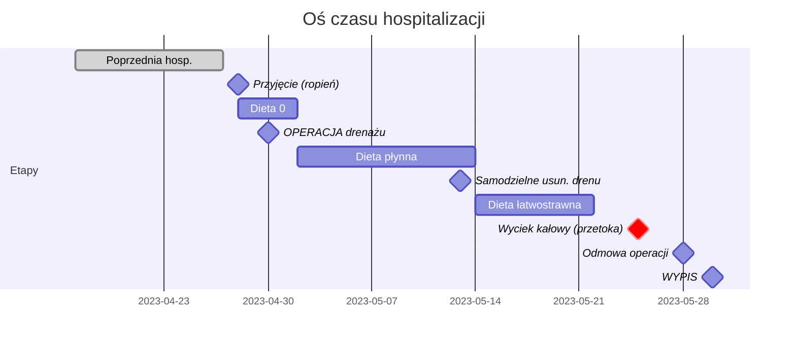

# Oś Czasu Hospitalizacji: 28.04.2023 - 30.05.2023
**Pacjent:** Michał Wiencek  
**Oddział:** Chirurgia Ogólna  
**Rozpoznanie końcowe:** Choroba Crohna (K50), ropień prawego podbrzusza, przetoka jelitowa samoistna

---

## Poprzednia Hospitalizacja (kontekst)
| Data | Zdarzenie | Źródło |
|------|-----------|--------|
| **17-27.04.2023** | Hospitalizacja przed bieżącym przyjęciem | str. 93 |

> [!CAUTION]
> Pacjent został wypisany 27.04 i wrócił **następnego dnia** (28.04) z ropniem. Sugeruje to nieadekwatne leczenie lub przedwczesny wypis z poprzedniej hospitalizacji.

---

## DZIEŃ 1: 28.04.2023 (Piątek) — PRZYJĘCIE
| Godzina | Zdarzenie | Źródło |
|---------|-----------|--------|
| ? | Przyjęcie w trybie nagłym (SOR) | str. 21-22 |
| ? | Rozpoznanie: L02.2 (Ropień skórny), K50 (Crohn) | str. 22 |
| ? | Badanie: zaczerwienienie i punktowa przetoka PP | str. 92 |
| ? | Wywiad: gorączka, ropień w przebiegu Crohna | str. 93 |
| ? | EKG: rytm zatokowy, normogram | str. 24-27 |
| ? | Lab: **CRP 151.78 mg/L** (norma <5) | str. 15 |
| ? | Zlecenie: **Dieta 0** (nic doustnie) | str. 30, 32 |
| ? | Zlecenie: **"Nie podawać Ibuprofenu!"** | str. 32 |
| ? | Leki: Metronidazol 3x500mg IV, Cipronex | str. 33 |
| ? | Założenie venflonu (SOR) | str. 106 |

---

## DZIEŃ 2: 29.04.2023 (Sobota)
| Godzina | Zdarzenie | Źródło |
|---------|-----------|--------|
| ? | Zmiana diety: "pije do woli + Nutridrinki" | str. 95 |
| ? | Płynoterapia: Optilyte IV | str. 34 |
| ? | Metronidazol IV kontynuacja | str. 34 |

---

## DZIEŃ 3: 30.04.2023 (Niedziela) — OPERACJA
| Godzina | Zdarzenie | Źródło |
|---------|-----------|--------|
| ? | Ocena anestezjologiczna: waga 59kg, wzrost 178cm | str. 67-68 |
| ? | Grupa krwi: AB Rh+ | str. 68 |
| ? | Podpisanie zgody na znieczulenie ogólne | str. 71 |
| ? | Podpisanie zgody na drenaż ropnia | str. 82 |
| **16:05** | **ROZPOCZĘCIE ZABIEGU** | str. 75 |
| 16:05-16:20 | **Nacięcie i drenaż ropnia jamy brzusznej** | str. 75, 77 |
| 16:20 | Zakończenie zabiegu (czas trwania: 15 min) | str. 75 |
| ? | Znieczulenie: Propofol + Fentanyl, ASA 2 | str. 72-73 |
| ? | Operator: lek. Lorenc | str. 81 |
| ? | Pobrano materiał na posiew | str. 77 |
| ? | Aldrete 10 pkt - pełne wybudzenie | str. 69 |
| ? | Usunięcie venflonu założonego 28.04 | str. 106 |

---

## DZIEŃ 4: 01.05.2023 (Poniedziałek)
| Godzina | Zdarzenie | Źródło |
|---------|-----------|--------|
| ? | **[ALARM] "Pacjent bardzo bólowy, płaczący"** | str. 103 |
| ? | Kontynuacja: Dieta 0 → płynna | str. 32-35 |
| ? | Leki przeciwbólowe: Pyralgina, Tramal IV | str. 33-34 |

---

## DZIEŃ 5: 02.05.2023 (Wtorek)
| Godzina | Zdarzenie | Źródło |
|---------|-----------|--------|
| ? | Zmiana diety na **dietę płynną** | str. 35 |
| ? | Metronidazol 3x500mg IV kontynuacja | str. 35 |

---

## DNI 6-10: 03-07.05.2023
| Data | Zdarzenie | Źródło |
|------|-----------|--------|
| 04-08.05 | Stan: obniżone samopoczucie, większość dnia w łóżku | str. 102 |
| 05.05 | Nutridrink 2x dziennie | str. 36 |
| 05.05 | Oxynorm 2x10mg p.o. | str. 36 |
| 06-09.05 | Dieta płynna, ocena bólu 6/10 | str. 45 |

---

## DZIEŃ 11: 08.05.2023
| Godzina | Zdarzenie | Źródło |
|---------|-----------|--------|
| ? | Kontynuacja: Metronidazol, Oxynorm, Pyralgina | str. 37 |
| ? | TK jamy brzusznej: **regresja zmian** vs 28.04 | str. 85 |

---

## DNI 12-14: 09-11.05.2023
| Data | Zdarzenie | Źródło |
|------|-----------|--------|
| 09.05 | Dieta płynna + Nutridrinki | str. 96 |
| 09-14.05 | **[ALARM] Stan depresyjny pacjenta** | str. 101 |
| 10-13.05 | Entocort, Metronidazol, Clexane, Controloc | str. 39 |

---

## DZIEŃ 16: 13.05.2023
| Godzina | Zdarzenie | Źródło |
|---------|-----------|--------|
| Noc | **[ALARM] Intensywne wymioty całą noc po antybiotykach** | str. 101, relacja pacjenta |
| ? | **[ALARM] DREN WYPADŁ podczas wymiotów** (wadliwa fiksacja) | str. 96, relacja pacjenta |
| ? | Dokumentacja szpitalna błędnie: "pacjent samodzielnie usunął" | str. 96 |

> [!CAUTION]
> **KOREKTA NA PODSTAWIE RELACJI PACJENTA:** Dren NIE został "samodzielnie usunięty" — **wypadł podczas intensywnych wymiotów** spowodowanych antybiotykami. Świadczy to o:
> 1. **Wadliwym założeniu/fiksacji drenu** (błąd chirurgiczny)
> 2. **Braku profilaktyki przeciwwymiotnej** przy agresywnej antybiotykoterapii
> 3. **Braku nadzoru pielęgniarskiego** w nocy podczas epizodu wymiotów
> 
> Dokumentacja szpitalna może zawierać **fałszywy zapis** przerzucający winę na pacjenta.

---

## DNI 17-18: 14-15.05.2023
| Data | Zdarzenie | Źródło |
|------|-----------|--------|
| 14.05 | Zmiana diety na **łatwostrawną** | str. 43 |
| 14-17.05 | Dreny: R-80, L-80 (nowe?) | str. 48 |
| 14-17.05 | Imipenem 3x1g IV | str. 48 |
| 15-20.05 | **Wyciek treści ropnej po usunięciu drenu** | str. 100 |

---

## DZIEŃ 19: 16.05.2023
| Godzina | Zdarzenie | Źródło |
|---------|-----------|--------|
| ? | TK kontrolne: dalsze **zmniejszenie zbiornika** | str. 85 |

---

## DNI 20-23: 17-20.05.2023
| Data | Zdarzenie | Źródło |
|------|-----------|--------|
| 18-21.05 | Dieta płynna, Clexane, Paracetamol | str. 51 |
| 20.05 | Nowe wkłucie obwodowe | str. 104 |
| 20-25.05 | Pasaż jelit, zmiany opatrunków | str. 99 |

---

## DZIEŃ 25: 22.05.2023
| Godzina | Zdarzenie | Źródło |
|---------|-----------|--------|
| ? | Zmiana diety na **Dietę III (rozszerzoną)** | str. 57 |
| ? | Kontrola drenażu | str. 56 |

---

## DZIEŃ 28: 25.05.2023
| Godzina | Zdarzenie | Źródło |
|---------|-----------|--------|
| ? | TK: **cechy przetoki jelito-powłoki** | str. 85 |
| ? | **[ALARM DOWODOWY] Wyciek treści kałowej z rany** | str. 97 |

> [!CAUTION]
> Kluczowe zdarzenie: Powstanie przetoki jelitowej z wyciekiem treści kałowej na zewnątrz — poważne powikłanie wymagające pilnego leczenia chirurgicznego.

---

## DNI 31-32: 28-29.05.2023
| Data | Zdarzenie | Źródło |
|------|-----------|--------|
| 28.05 | **[ALARM] Pacjent odmawia operacji w tym ośrodku** | str. 97 |
| 28.05 | Szuka innego ośrodka do leczenia | str. 97 |
| 29.05 | Metronidazol kontynuacja, Nutridrink 2.0 | str. 63 |
| 29.05 | Drenaż opłucnej (adnotacja) | str. 60, 62 |

---

## DZIEŃ 33: 30.05.2023 — WYPIS
| Godzina | Zdarzenie | Źródło |
|---------|-----------|--------|
| ? | **WYPIS ze szpitala** | str. 83-91 |
| ? | Rozpoznanie końcowe: Crohn, ropień PP, przetoka samoistna | str. 83 |
| ? | Posiew: **Klebsiella pneumoniae ESBL(+)** | str. 88 |
| ? | CRP przy wypisie: 31 mg/L (spadek z 142)| str. 86 |
| ? | Zalecenia: dieta ubogoresztkowa, pilne skierowanie | str. 88 |
| ? | E-recepta: Clexane 40mg | str. 90 |
| ? | Lekarz wypisujący: Wacław Grzegorz Byrdy | str. 89 |

---

## PODSUMOWANIE CHRONOLOGICZNE

### Kluczowe Interwały:
| Od | Do | Dni | Zdarzenie |
|----|----|----|-----------|
| 28.04 | 30.04 | 2 | Oczekiwanie na operację drenażu |
| 30.04 | 13.05 | 13 | Dren w miejscu |
| 13.05 | 25.05 | 12 | Od usunięcia drenu do wycieku kałowego |
| 25.05 | 30.05 | 5 | Przetoka → wypis bez definitywnego leczenia |

---

## ALARMY DOWODOWE (RED FLAGS)

| Data | Zdarzenie | Ocena medyczno-prawna |
|------|-----------|----------------------|
| 27→28.04 | Powrót dzień po wypisie | Przedwczesny wypis z poprzedniej hosp.? |
| 01.05 | "Pacjent bardzo bólowy, płaczący" | Nieadekwatna kontrola bólu? |
| 13.05 | **Dren WYPADŁ podczas wymiotów** | **Błąd fiksacji + Fałszywa dokumentacja** |
| 13.05 | Intensywne wymioty całą noc | Brak profilaktyki przeciwwymiotnej |
| 25.05 | Wyciek treści kałowej | Powstanie przetoki jelitowej |
| 28.05 | Odmowa operacji tutaj | Utrata zaufania pacjenta |
| 30.05 | Wypis z przetoką i ESBL+ | Wypis bez definitywnego leczenia chirurgicznego |
