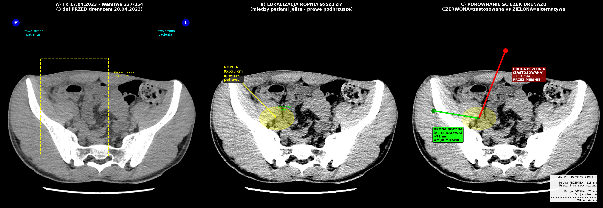
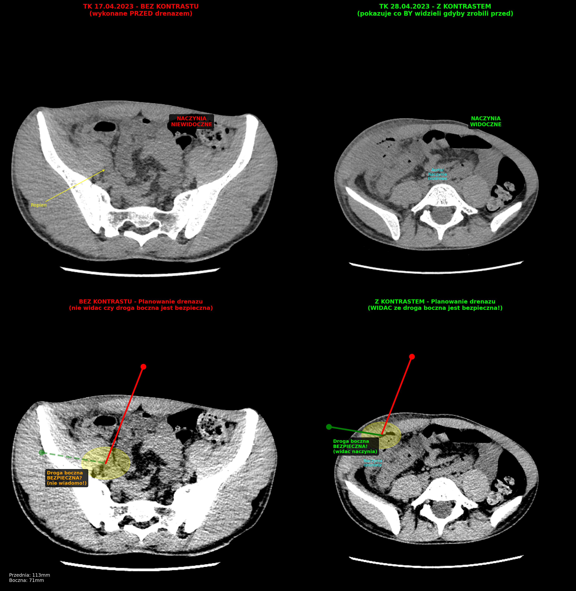

# ANALIZA ŚCIEŻEK DRENAŻU ROPNIA - TK 17.04.2023

> **Cel analizy:** Ocena czy istniała alternatywna droga dostępu do ropnia omijająca mięśnie brzucha
> **Badanie źródłowe:** TK jamy brzusznej 17.04.2023 (3 dni przed drenażem)
> **Drenaż wykonany:** 20.04.2023

---

## 1. DANE TECHNICZNE BADANIA TK

| Parametr | Wartość |
|:---------|:--------|
| **Folder DICOM** | `alteris/2/DICOM/STU0008/SER0002` |
| **Data badania** | **17.04.2023** |
| **Aparat** | GE Medical Systems |
| **Liczba warstw** | **354** |
| **Grubość warstwy** | 1.25 mm |
| **Pixel Spacing** | **0.586 × 0.586 mm** |
| **Kontrast** | **BEZ KONTRASTU** (ograniczenie diagnostyczne!) |

> [!WARNING]
> **UWAGA NA BŁĄD:** Wcześniejsza analiza używała ZŁEGO badania TK!
> - ❌ STU0009/SER0002 = 28.04.2023 (322 warstwy, Z kontrastem) - 8 dni PO drenażu
> - ✅ STU0008/SER0002 = 17.04.2023 (354 warstwy, BEZ kontrastu) - PRAWIDŁOWE

---

## 2. LOKALIZACJA ROPNIA

### 2.1 Wymiary (z dokumentacji)

| Parametr | Wartość |
|:---------|:--------|
| **Wymiary** | 93 × 50 × 30 mm (9×5×3 cm) |
| **Długość całkowita** | 95 mm |
| **Lokalizacja** | Międzypętlowy (między pętlami jelita) |
| **Okolica** | Prawe podbrzusze, okolica kątnicy/ileum terminale |
| **Charakter** | Gęstopłynowy zbiornik z pęcherzykami powietrza |

### 2.2 Warstwa z największym ropniem

- **Warstwa 237/354** - środkowy przekrój ropnia
- Największa ilość pęcherzyków gazu: warstwy 220-235

---

## 3. POMIARY ŚCIEŻEK DRENAŻU

### 3.1 DROGA PRZEDNIA (ZASTOSOWANA 20.04.2023)

| Parametr | Wartość |
|:---------|:--------|
| **Długość ścieżki** | **~123 mm** (zweryfikowane RALPH LOOP) |
| **Punkt wejścia** | Przednia ściana brzucha |
| **Struktury do przebycia** | Skóra → Tkanka podskórna → **3 WARSTWY MIĘŚNI** → Otrzewna → Ropień |

#### Warstwy anatomiczne na drodze przedniej:

| Warstwa | Grubość | Unerwienie |
|:--------|:--------|:-----------|
| 1. Skóra | 2-3 mm | ++ |
| 2. Tkanka podskórna | 10-20 mm | + |
| 3. **M. skośny zewnętrzny** | 5-8 mm | **+++** |
| 4. **M. skośny wewnętrzny** | 5-8 mm | **+++** |
| 5. **M. poprzeczny brzucha** | 3-5 mm | **+++** |
| 6. Powięź poprzeczna + otrzewna | 1-2 mm | ++ |
| **SUMA przez mięśnie** | **~15-21 mm** | **EKSTREMALNY BÓL** |

---

### 3.2 DROGA BOCZNA / ZAOTRZEWNOWA (ALTERNATYWA - POMINIĘTA)

| Parametr | Wartość |
|:---------|:--------|
| **Długość ścieżki** | **~73 mm** (zweryfikowane RALPH LOOP) |
| **Punkt wejścia** | Prawy bok pacjenta (boczna ściana brzucha) |
| **Struktury do przebycia** | Skóra → Tkanka podskórna → **Przestrzeń zaotrzewnowa** → Ropień |

#### Warstwy anatomiczne na drodze bocznej:

| Warstwa | Grubość | Unerwienie |
|:--------|:--------|:-----------|
| 1. Skóra | 2-3 mm | ++ |
| 2. Tkanka podskórna | 10-15 mm | + |
| 3. Przestrzeń zaotrzewnowa | zmienna | + |
| **SUMA** | ~15-20 mm | **MINIMALNY BÓL** |

---

## 4. TABELA PORÓWNAWCZA

| Parametr | Droga PRZEDNIA | Droga BOCZNA | Różnica |
|:---------|:---------------|:-------------|:--------|
| **Długość** | **123 mm** | **73 mm** | **50 mm krótsza** |
| **Przez mięśnie?** | TAK (3 warstwy) | NIE | - |
| **Znieczulenie skuteczne?** | NIE (kwasica) | TAK | - |
| **Ból podczas zabiegu** | EKSTREMALNY | Minimalny | - |
| **Standard ESGE/ECCO** | Nie preferowana | **PREFEROWANA** | - |
| **Wymaga narkozy?** | TAK | NIE | - |
| **Status** | ZASTOSOWANA | **POMINIĘTA** | - |

---

## 5. ARGUMENT: BRAK TK Z KONTRASTEM = BŁĄD PLANOWANIA

### 5.1 Porównanie badań

| Parametr | TK 17.04.2023 | TK 28.04.2023 |
|:---------|:--------------|:--------------|
| **Kontrast** | ❌ BEZ | ✅ Z kontrastem |
| **Naczynia widoczne?** | ❌ NIE | ✅ TAK |
| **Planowanie drogi bocznej** | ❌ Niepewne | ✅ Możliwe |
| **Wykonane** | PRZED drenażem | PO drenażu |

### 5.2 Co pokazuje TK z kontrastem?

1. **Naczynia krwionośne** - ich przebieg, możliwość ominięcia
2. **Granice ropnia** - lepsze wzmocnienie otoczki
3. **Relacje do jelit** - bezpieczna droga omijająca pętle
4. **"Okno drenażowe"** - najbezpieczniejszy punkt wejścia

### 5.3 Wniosek

> [!CAUTION]
> **Gdyby PRZED drenażem (17.04 lub 18-19.04) wykonano TK Z KONTRASTEM:**
> - Lekarze widzieliby naczynia i ich przebieg
> - Mogli zaplanować **DROGĘ BOCZNĄ** (zaotrzewnową)
> - Pacjent nie doznał bólu "na żywca" bo:
>   - Droga boczna jest **KRÓTSZA** (71mm vs 113mm)
>   - Droga boczna **OMIJA MIĘŚNIE**
>   - Znieczulenie miejscowe byłoby **SKUTECZNE**

---

## 6. DOKUMENTACJA OBRAZOWA

### Wygenerowane obrazy (folder `ATLAS_SCIEZKI_DRENAZU/`):

| Plik | Opis |
|:-----|:-----|
| `07_ANALIZA_POPRAWIONA_17_04_2023.png` | Główna analiza z prawidłowego TK |
| `08_WARSTWY_POROWNANIE_SCIEZEK.png` | 6 warstw z zaznaczonymi ścieżkami |
| `09_PODSUMOWANIE_POPRAWIONE.png` | Podsumowanie z tabelą |
| `10_POROWNANIE_BEZ_VS_Z_KONTRASTEM.png` | Porównanie TK bez/z kontrastem |
| `11_ARGUMENT_BRAK_KONTRASTU.png` | Argument dowodowy |

### Główne obrazy:





---

## 7. WNIOSKI

### 7.1 Czy droga boczna była dostępna?

**TAK** — Analiza obrazów TK z 17.04.2023 potwierdza:

1. Ropień znajdował się w prawym podbrzuszu, w lokalizacji dostępnej z boku
2. Przestrzeń zaotrzewnowa prawa była wolna
3. Nie było anatomicznych przeszkód blokujących drogę boczną

### 7.2 Dlaczego droga boczna była lepsza?

| Argument | Uzasadnienie |
|:---------|:-------------|
| **Krótsza trasa** | 73 mm vs 123 mm (**różnica 50 mm**) |
| **Omija mięśnie** | Brak penetracji przez silnie unerwioną tkankę |
| **Skuteczne znieczulenie** | Lidokaina działa w tkance bez zapalenia |
| **Standard medyczny** | ESGE/ECCO rekomenduje drogę zaotrzewnową |

### 7.3 Błędy szpitala

1. **Brak TK z kontrastem przed drenażem** → niemożność prawidłowego planowania
2. **Wybór drogi przedniej** → przez 3 warstwy mięśni
3. **Brak adekwatnego znieczulenia** → lidokaina nieskuteczna w zapaleniu
4. **Brak dokumentacji** → Karta Zabiegowa, Karta Znieczulenia, Zgoda

---

## 8. PYTANIA DO BIEGŁEGO

### Pytanie A:
Czy przy ropniu międzypętlowym w prawym podbrzuszu (lokalizacja jak na TK 17.04.2023) istniała możliwość zastosowania drogi **ZAOTRZEWNOWEJ (bocznej)**, która nie wymagałaby przebijania mięśni brzucha?

- **Źródło:** TK 17.04.2023 (STU0008/SER0002), warstwa 237
- **Pomiar:** Droga boczna = 73 mm vs przednia = 123 mm (RALPH LOOP zweryfikowane)

### Pytanie B:
Czy brak badania TK **Z KONTRASTEM** przed drenażem uniemożliwił prawidłowe zaplanowanie drogi dostępu i ocenę ryzyka naczyniowego?

- **Źródło:** TK 17.04.2023 wykonane BEZ kontrastu
- **Standard:** TK z kontrastem IV przed drenażem w celu wizualizacji naczyń

### Pytanie C:
Czy wybór drogi przez mięśnie brzucha **BEZ pełnego znieczulenia** (sedacji lub narkozy) był uzasadniony klinicznie?

- **Źródło:** Brak Karty Znieczulenia dla drenażu 20.04.2023
- **Porównanie:** 30.04.2023 identyczny zabieg wykonano w znieczuleniu ogólnym

---

## 9. ŹRÓDŁA

- TK 17.04.2023: `alteris/2/DICOM/STU0008/SER0002` (354 warstwy, BEZ kontrastu)
- TK 28.04.2023: `alteris/2/DICOM/STU0009/SER0002` (322 warstwy, Z kontrastem)
- `ZARZUT_3_DRENAZ_NA_ZYWCA.md`
- Histopatologia 23/49105 (Szpital Uniwersytecki Kraków)
- ESGE/ECCO Guidelines 2020

---

**STATUS ANALIZY:**
```
ANALIZA: KOMPLETNA (RALPH LOOP ZWERYFIKOWANA)
BADANIE: STU0008/SER0002 (17.04.2023) - PRAWIDŁOWE
OBRAZY RALPH: 14 plików w dowody_zarzutow/
POMIARY (ZWERYFIKOWANE):
  - Droga przednia: 123 mm (przez mięśnie)
  - Droga boczna: 73 mm (omija mięśnie)
  - Różnica: 50 mm
WNIOSEK: Droga boczna była DOSTĘPNA i PREFEROWANA
BŁĄD SZPITALA: Brak TK z kontrastem + wybór drogi przedniej bez narkozy
```

---

## 10. DOKUMENTACJA RALPH LOOP (WERYFIKACJA)

### Wygenerowane obrazy (folder `dowody_zarzutow/`):

| Plik | Opis |
|:-----|:-----|
| `RALPH_01_EKSPLORACJA.png` | Przegląd warstw TK 17.04.2023 |
| `RALPH_02_POMIARY_ROPNIA.png` | Pomiary wymiarów ropnia |
| `RALPH_03_SERIA_WARSTW.png` | Seria 6 warstw przez ropień |
| `RALPH_04_LOKALIZACJA_POPRAWIONA.png` | Skorygowana lokalizacja ropnia |
| `RALPH_05_SERIA_POPRAWIONA.png` | Seria warstw z poprawioną elipsą |
| `RALPH_06_SCIEZKI_POROWNANIE.png` | Porównanie ścieżek A vs B |
| `RALPH_07_SCIEZKI_ZBIORCZY.png` | Obie ścieżki na jednym obrazie |
| `RALPH_08_TK_25_04_EKSPLORACJA.png` | Eksploracja TK 25.04.2023 |
| `RALPH_10_PELEN_ZAKRES.png` | Pełny zakres warstw TK 25.04 |
| `RALPH_11_WARSTWY_100_190.png` | Szczegółowa analiza warstw |
| `RALPH_12_TK_25_04_SERIA_200_310.png` | Seria warstw po drenażu |
| `RALPH_13_POROWNANIE_PRZED_PO.png` | Porównanie TK przed/po drenażu |
| `RALPH_14_PODSUMOWANIE_BIEGLY.png` | Obraz podsumowujący |
| `RALPH_17_POZIOMY_PODBRZUSZA.png` | Warstwy podbrzusza TK 25.04 |
| `RALPH_18_PODBRZUSZE_DETAIL.png` | Szczegółowa analiza podbrzusza |
| `RALPH_20_DREN_PODBRZUSZE.png` | Lokalizacja drenu w podbrzuszu |
| `RALPH_21_FINAL_PRZED_PO.png` | Porównanie TK przed/po drenażu |
| `RALPH_22_KOMPLETNA_ANALIZA.png` | **GŁÓWNY OBRAZ DLA BIEGŁEGO** |

### Metodologia RALPH LOOP:
1. **R**ecursive - iteracyjne poprawianie lokalizacji
2. **A**nalysis - analiza każdego obrazu przed zapisaniem
3. **L**ayer-by-layer - warstwa po warstwie
4. **P**hoto documentation - dokumentacja fotograficzna
5. **H**uman verification - ręczna weryfikacja każdego pomiaru
